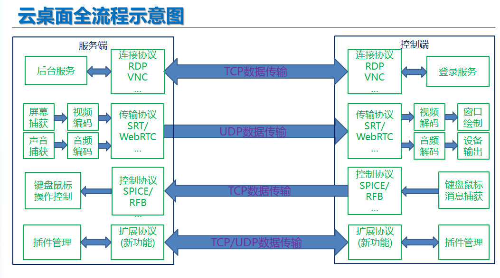

# 云桌面开发设计




### RDP登录/后台服务
- 目的
Windows在账号未激活的情况下，无法进行截屏，需要登录后开启相应的后台服务支持客户端的连接
- 任务
1.封装相应的RDP登录模块
2.验证Windows上如何实现后台程序的开启
3.实现完整的流程，使用Windows账号密码能在另一台机器上通过RDP连接登录上对应的机器，并启动相应的后台程序
4.不要求后台程序的功能，程序能自动启动即可
- 资料
https://github.com/FreeRDP/FreeRDP

### WebRTC传输
- 目的
1.低延迟的视音频传输
2.适配浏览器用户

### 屏幕捕获/音频捕获/显卡编码
- 目的
屏幕和音频捕获

- 任务
1.实现屏幕编码数据稳定帧率的输出
2.使用DXGI实现屏幕捕获功能，并直接调用NVIDIA显卡编码
3.实现音频捕获提供连续的音频输出功能
4.实现完整的流程使用样例程序，把当前屏幕的内容和音频录制为媒体文件

- 难点
HDR截屏

### 显卡解码/实时渲染/音频设备输出
- 目的
云桌面客户端的基本必备功能

- 任务
1.调用NVIDIA显卡解码支持相应的解码数据直接渲染
2.实现完整的流程为简易播放器软件，支持播放特定的媒体文件进行实时的画面显示
和同步的音频声音输出，窗口需支持按任意幅面缩放，最大化，缩放必须包含如下算法：
水平对齐，垂直对齐，拉伸
3.后续会有封装要求，所以前期流程代码的实现需充分考虑整个流程的模块划分
4.开发平台使用QT，渲染引擎使用OpenGL

### 远程键盘鼠标控制
- 目标
云桌面客户端操作控制的基本必备功能

- 任务
1.键盘/鼠标操作的定义
2.客户端和服务端的简单通信
3.控制当前桌面鼠标的移动，实现键盘的虚拟按键操作（包括组合键）
4.捕获当前窗口程序中键盘的消息，当前窗口鼠标的消息

- 要求
1.在被控制的机器（服务端）上启动一个后台程序，在进行控制的机器（客户端）
上启动一个窗口程序
2.客户端窗口程序启动时支持设置窗口的大小，需考虑与当前屏幕的适配，
例如设置大小超过当前窗口大小
3.客户端窗口程序支持按任意幅面缩放（可设定最小幅面），最大化操作，
缩放需考虑：水平对齐，垂直对齐，拉伸
4.当鼠标在客户端的窗口内移动时，相应的远端鼠标也跟随移动，移动到边缘位置时，x
需要有一定强度的吸附效果，移动时的映射关系需考虑缩放时使用的算法，同时在当前窗口
是焦点时使用键盘操作，远端也能同样的响应


***
### 资料

[RDP](https://github.com/FreeRDP/FreeRDP)

[远程键盘鼠标控制-VNC](https://github.com/ultravnc/UltraVNC)

[FreeRDP-Manuals](https://github.com/awakecoding/FreeRDP-Manuals/blob/master/User/FreeRDP-User-Manual.markdown)

[Windows编译FreeRDP](https://blog.csdn.net/defaultbyzt/article/details/108099252)

[通过安装VNC服务器x11vnc(或vnc4server)和配置x11vnc.service实现远程通过VNC-Viewer访问VNC服务器](https://blog.csdn.net/Arron475/article/details/122349945)

[详解远程桌面协议， Linux 和 Windows 间的远程桌面互相访问（RDP、VNC协议）](https://blog.csdn.net/qq_27825451/article/details/101213110?utm_source=app&app_version=5.5.0&code=app_1562916241&uLinkId=usr1mkqgl919blen)

[UltraVNC VS TigerVNC](https://www.saashub.com/compare-ultravnc-vs-tigervnc)

[The RFB Protocol](https://github.com/rfbproto/rfbproto/blob/master/rfbproto.rst)

[The Remote Framebuffer Protocol](https://datatracker.ietf.org/doc/html/rfc6143)

[FLTK优缺点简介（备用）](https://blog.csdn.net/rxm1989/article/details/39549611?spm=1001.2101.3001.6650.1&utm_medium=distribute.pc_relevant.none-task-blog-2%7Edefault%7ECTRLIST%7Edefault-1-39549611-blog-106623821.pc_relevant_blogantidownloadv1&depth_1-utm_source=distribute.pc_relevant.none-task-blog-2%7Edefault%7ECTRLIST%7Edefault-1-39549611-blog-106623821.pc_relevant_blogantidownloadv1&utm_relevant_index=2)

[win10平台搭建FTLK开发环境](https://blog.csdn.net/sanqima/article/details/108184789)

[Compiling TigerVNC for Windows](https://github.com/TigerVNC/tigervnc/wiki/Compiling-TigerVNC-for-Windows)

[开源远程控制RealVNC源代码中的通讯协议RFB（远程帧缓冲）](https://blog.csdn.net/witch_soya/article/details/27214405)

[VNC源码研究（一）](https://blog.csdn.net/qq_37375427/article/details/86567056?utm_medium=distribute.pc_relevant.none-task-blog-2~default~baidujs_baidulandingword~default-0-86567056-blog-90239535.pc_relevant_aa&spm=1001.2101.3001.4242.1&utm_relevant_index=3)

***

### VNC vs RDP
1. VNC(Virtual Network Computing)
【定义】：VNC，为一种使用RFB（ Remote Frame Buffer 远程帧缓冲）协议的显示屏画面分享及远程操作软件。
【特性】：VNC与操作系统无关，因此可跨平台使用，例如可用Windows连线到某Linux的计算机，反之亦同。甚至在没有安装客户端程序的计算机中，只要有支持JAVA的浏览器，也可使用。
【使用RFB协议从mac连接远程mac】：Finder->Go->Connect to server->输入远程IP

2. 远程桌面（Remote desktop）
【定义】：远程桌面使用远程桌面协议。大部分Windows都默认支持此协议，可以远程接入操作桌面。

3. RDP vs. RFP
RFB是在服务器端将窗口在显存中画好之后将图像传给客户端，客户端只充当一个图像解码显示的角色； RDP则将画图的工作交给了客户端，服务器需要了解客户端显示能力的具体情况，以便作出相应调整。

RFB主要传图像，RDP主要传指令。就一般应用而言，RFB数据量太大，RDP对客户端要求较高，因此RFB适用于瘦客户端，RDP适用于低速网络。

### 远程协议VNC/SPICE/RDP
|   | SPICE  | VNC  | RDP|
|---|---|---|---|
|  BIOS屏幕显示 |   |   |   |
|   |   |   |   |
|   |   |   |   |
|   |   |   |   |
|   |   |   |   |
|   |   |   |   |
|   |   |   |   |
|   |   |   |   |
|   |   |   |   |
|   |   |   |   |


### VNC开源项目
```
LibVNC
UltraVNC
TightVNC 1.x
TightVNC 1.x
```

### UltraVNC编译问题
- windows

1. 下载源码
```bash
git clone git@github.com:ultravnc/UltraVNC.git
```

2. 下载nasm
```
https://www.nasm.us/pub/nasm/releasebuilds/2.15.05/

win64
https://www.nasm.us/pub/nasm/releasebuilds/2.15.05/win64/
```

3. 配置nasm
```
安装nasm后，将bin目录添加到系统环境变量中
```

4. vs2019启动工程
```
客户端
进入\UltraVNC\vncviewer\目录，用vs2019打开vncviewer_vs2017.sln工程
注意使用vs2019，ultraVNC最近有改动，已改为vs2019编译
```

5. 修改编译报错
将\UltraVNC\vncviewer\KeyMap.h改为utf-8编码格式，将编译报错代码改为如下
```C++
static const vncDeadKeyMapping_t deadKeyMap[] = {
    {XK_dead_grave          , L'`'    },  // +U0060
    {XK_dead_acute          , L'?'   },  // +U00B4
    {XK_dead_acute          , L'\''   },  // +U0027
    {XK_dead_circumflex     , L'^'    },  // +U005E
    {XK_dead_tilde          , L'~'    },  // +U007E
    {XK_dead_diaeresis      , L'?'    },  // +U00A8
    {XK_dead_diaeresis      , L'"'    },  // +U0022
    {XK_dead_abovering      , L'?'    },  // +U00B0
    {XK_dead_cedilla        , L'?'    },  // +U00B8
};
```
### UltraVNC
- \UltraVNC\rfb
协议
